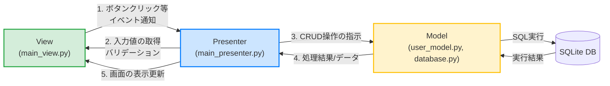

# customtkinter-mvp-crud

CustomTkinterとMVP (Model-View-Presenter) パターンを用いた、SQLiteテーブルのCRUD操作を行うサンプルアプリケーションです。

## 特徴
- **CustomTkinter**: モダンなダーク/ライトテーマ対応のGUI。
- **MVPアーキテクチャ**: ビジネスロジック（Model）、UI（View）、そしてそれらの橋渡し（Presenter）を分離し、保守性とテスト容易性を高めています。
- **SQLite3**: Python標準ライブラリの `sqlite3` を用いたローカルデータベース管理。

---

## アーキテクチャ (MVP)

このアプリケーションは、**Model-View-Presenter** パターンを採用しています。UIコンポーネントとビジネスロジックを分離することで、コードの肥大化を防ぎ、保守性を高めています。



### 各層の役割
1. **Model (`src/model/`)**: 
   データベースの接続管理と、実際のCRUD処理を担当します。UI（View）やPresenterについては一切関知しません。
2. **View (`src/view/`)**:
   `customtkinter` を使用したUIの描画を担当します。入力データの取得（`get_inputs`）や、画面の更新（`display_users`）を行うメソッドを提供しますが、**データベースの処理やビジネスロジックは一切含みません**。
3. **Presenter (`src/presenter/`)**:
   ModelとViewの仲介役です。Viewからイベント（追加ボタンが押された等）を受け取り、入力値のバリデーションを行った後、Modelにデータの更新を指示します。その後、最新のデータをModelから取得してViewに表示を更新させます。

---

## ファイル構成

```text
customtkinter-mvp-crud/
├── src/
│   ├── model/
│   │   ├── database.py       # データベース接続とテーブル初期化
│   │   └── user_model.py     # ユーザーテーブルのCRUD処理
│   ├── view/
│   │   └── main_view.py      # UIレイアウトとウィジェット
│   └── presenter/
│       └── main_presenter.py # ViewとModelの仲介と制御
├── main.py                   # エントリーポイント (依存性の注入と起動)
├── pyproject.toml
└── README.md
```

---

## セットアップと実行

このプロジェクトはパッケージマネージャとして `uv` を使用しています。

1. **依存関係のインストール**:
   ```bash
   uv sync
   ```
   ※手動で行う場合は `uv add customtkinter` を実行してください。

2. **アプリケーションの実行**:
   ```bash
   uv run python main.py
   ```

---

## ビルド (Windows環境用シングルバイナリ)

Windows環境で配布可能な単一の実行ファイル（`.exe`）を作成するためのスクリプト `build.py` が用意されています。ビルドは**必ず対象のOS（Windows）上で行う**必要があります。

1. **Windows環境** でプロジェクトをクローンし、依存関係をインストールします。
   ```bash
   uv sync
   ```
2. **ビルドスクリプトを実行** します。
   ```bash
   uv run python build.py
   ```
3. ビルドが成功すると、`dist/` フォルダ内に `MVP_CRUD_App.exe` が生成されます。このファイル単体で他のWindowsマシンでも実行可能です。

---

## テンプレートから発展させるためのガイダンス

このサンプルをベースにして、より大規模なアプリケーションへと拡張していくための推奨プラクティスです。

### 1. 新しいテーブル（エンティティ）の追加
- `src/model/` に新しいモデルクラス（例: `product_model.py`）を作成します。
- `src/model/database.py` の `init_db` 関数内に新しいテーブルを作成する `CREATE TABLE` クエリを追記します。

### 2. 画面の複雑化への対応 (複数タブ・複数画面)
- Viewが肥大化してきた場合、1つのViewクラスに全てのUIを詰め込まず、コンポーネントごとにクラスを分割してください。
- 複数の画面が必要な場合は、`customtkinter.CTkTabview` を用いてタブ切り替えにするか、`customtkinter.CTkToplevel` を使って別ウィンドウを開く設計にします。
- **Presenterの分割**: 画面やタブごとに専用のPresenterを作成し、メインのPresenterがそれらを管理する（または互いに独立させる）設計にすると保守性が保てます。

### 3. バリデーションとエラーハンドリングの強化
- 現在はPresenter内に単純な入力チェック（空チェックや数値変換）を書いていますが、要件が複雑になる場合は **専用のバリデーションクラス** を作成し、Presenterから呼び出すようにしてください。
- カスタム例外（例: `ValidationError`, `RecordNotFoundError`）を定義し、Modelから送出された例外をPresenterでキャッチしてViewに適切なエラーメッセージを渡すようにすると綺麗です。

### 4. ユニットテストの導入
- MVPアーキテクチャの最大の利点は **「UI（View）を切り離してテストができること」** です。
- Presenterをテストする際は、`MainView` クラスのモック（Mock）を作成してPresenterに渡し、「メソッドが正しく呼ばれたか」「エラーが表示されたか」をテストします。
- Modelをテストする際は、本番用の `app.db` ではなく、インメモリデータベース（`:memory:`）のパスを渡すことで安全かつ高速にテストが実行できます。
